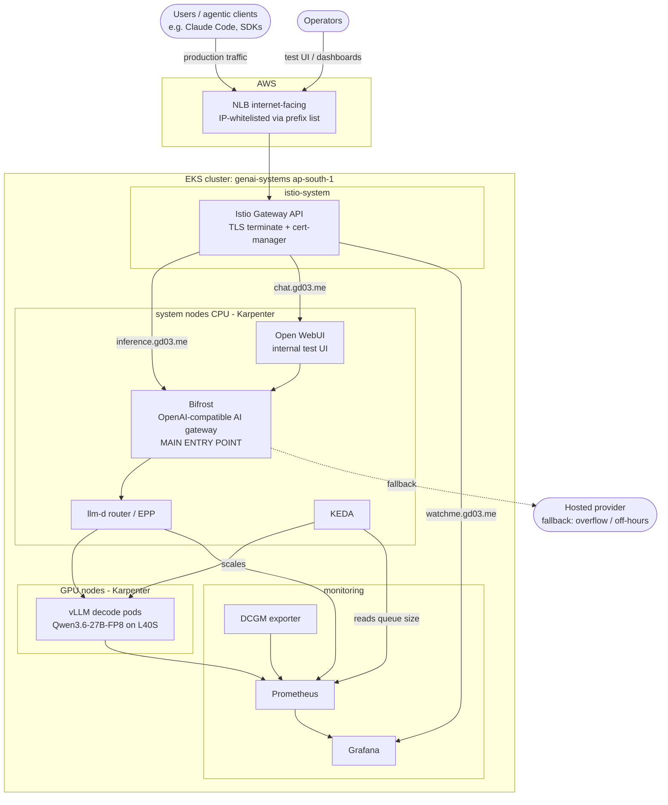

# inference-infra

A **production self-hosted LLM inference stack** on Amazon EKS. This repo holds every
manifest and the full runbook used to take a `genai-systems` cluster in `ap-south-1` from
empty to a live, monitored, auto-scaling inference platform that speaks the OpenAI API.

It is built to serve open-weight coding/agentic models to a real pool of users behind a
single gateway, with the properties you want from production: node and pod autoscaling
tied to real serving load, GPU-cost-aware consolidation, TLS ingress with IP allowlisting,
end-to-end observability (cluster, GPU, and serving metrics), and a hosted-provider
fallback for overflow and off-hours so users never hit a wall. The design intent is for a
self-hosted model to stand in for a hosted frontier model for day-to-day agentic work.

The manifests here are the source of truth. This README is the story of how they fit
together and the order they were applied. Each folder has its own README with the exact
commands for that piece.

> Note to self / readers: screenshots and a companion blog post will land later and
> will reference this repo.

---

## The inference stack

| Layer | Tool | What it does |
|-------|------|--------------|
| Serving engine | **vLLM** | Runs the model, exposes an OpenAI-compatible API plus Prometheus metrics |
| Router + model orchestration | **llm-d** (v0.8.1, router chart v0.9.0) | Prefix-aware routing and model-server management through the EPP (Endpoint Picker) |
| Inference extension | **GAIE** (Gateway API Inference Extension) | CRDs that let a gateway route by inference-pool semantics |
| Node autoscaling | **Karpenter** | Provisions and consolidates GPU and CPU nodes on demand from NodePools |
| Pod autoscaling | **KEDA** | Scales model replicas on real vLLM/EPP metrics (queue depth), not on CPU |
| Ingress + mesh | **Istio** with the **Gateway API** | GatewayClass `istio`, TLS termination, HTTPRoutes |
| Certificates | **cert-manager** | Let's Encrypt HTTP-01 certs for the gateway |
| AI gateway | **Bifrost** | The main entry point: one OpenAI-compatible front door that fans out to vLLM backends and hosted providers |
| Monitoring | **kube-prometheus-stack** and **DCGM exporter** | Cluster, GPU, and serving metrics into Grafana |
| Test chat UI | **Open WebUI** | Internal UI for testing cluster models directly (not the production front door) |

### A note on llm-d

llm-d is the router plus model-server layer. A couple of things about it that shaped the
design:

- It does **prefix-aware routing**, so requests that share a prefix land on the same
  worker and reuse its KV cache instead of recomputing it.
- It integrates **LMCache** as a pluggable KV-cache manager.
- LMCache uses NVIDIA's **NIXL** to offload and move caches over whatever route is best,
  which on AWS means **EFA** for fast inter-node transfer.

llm-d infra is deployed once. Each model then gets its own stack (model server via
kustomize, router via Helm). More on that in [`infra-qwen36/`](infra-qwen36/).

### Why Karpenter, KEDA and llm-d together

Each answers a different question, and they chain:

- **Karpenter**: "is there a node to run this pod?" It launches a GPU node only when a
  pending pod needs one, and consolidates it away when idle (1 to 5 minutes after empty)
  to stop paying for idle GPUs.
- **KEDA**: "do I need more model replicas?" It watches the llm-d EPP's average queue
  size and adds a `decode` replica when requests back up. That new replica becomes a
  pending pod, which is exactly what triggers Karpenter.
- **llm-d**: "which replica should this request go to?" Prefix-aware routing keeps
  related requests together for KV-cache reuse.

---

## Production posture

This is meant to run as a real platform, not a demo. The properties that make it
production-grade:

- **Single hardened entry point.** All production traffic goes through Bifrost behind a
  TLS-terminated Istio gateway on an internet-facing NLB that is IP-allowlisted via an AWS
  prefix list. Nothing else is user-facing.
- **Autoscaling on real load.** KEDA scales replicas on the llm-d EPP queue depth (a true
  serving signal), and Karpenter provisions the GPU nodes underneath. It scales up under
  pressure and consolidates idle GPUs away within minutes so you are not paying for silence.
- **Graceful degradation.** On queue overflow, or when GPU nodes are shut down off-hours,
  Bifrost falls back to a hosted provider so users never hit a wall.
- **Full observability.** Cluster, GPU (DCGM), and serving (vLLM + EPP) metrics all land in
  Prometheus and Grafana, including a custom EPP dashboard that shows the same signal KEDA
  scales on.
- **Cost-aware by design.** Spot for interruption-tolerant prefill, on-demand for
  user-visible decode, aggressive GPU consolidation, and gateway-level cost modeling to
  measure savings against the hosted baseline.
- **Reproducible.** Every component is captured as manifests and a documented runbook;
  IAM is wired through EKS Pod Identity rather than long-lived keys.

Known gaps to close before calling it fully hardened: secrets are created imperatively
(`HF_TOKEN`, Bifrost key) and should move to a managed secrets store; there is no GitOps
reconciliation yet (apply is manual); and single-region, single-AZ-per-pool means no
cross-region failover. These are called out where relevant in the folder READMEs.

---

## Cluster skeleton



Users and agentic clients connect to **Bifrost** (`inference.gd03.me`), the single
OpenAI-compatible entry point for production traffic. Open WebUI (`chat.gd03.me`) is an
internal UI for testing cluster models by hand; it also talks to Bifrost, so it is a
convenience for testing rather than the production front door. Grafana
(`watchme.gd03.me`) is for operators.

For the deeper view (request path, autoscaling loop, KV cache, node topology) see
[`docs/architecture.md`](docs/architecture.md).

---

## Repository layout

```
.
├── README.md                     # this file, the full runbook
├── docs/
│   └── architecture.md           # deeper architecture write-up with diagrams
├── gp3-storageclass.yaml         # default StorageClass (EBS gp3, WaitForFirstConsumer)
├── vllm-qwen3.6-4b.yaml          # standalone vanilla-vLLM deploy (no llm-d), for smoke/dev
│
├── karpenter/                    # node autoscaling: nodeclasses, nodepools, GPU smoke test
├── gateway/                      # Istio Gateway + cert-manager ClusterIssuer (TLS ingress)
├── monitoring/                   # kube-prometheus-stack values, DCGM exporter, EPP dashboard, routes
├── bifrost/                      # AI gateway deployment + route + servicemonitor
├── chat/                         # Open WebUI deployment + route
└── infra-qwen36/                 # a full llm-d model deployment: Qwen3.6-27B-FP8 on L40S
    ├── nodepools-qwen36.yaml
    ├── keda-scaledobject-qwen36.yaml
    └── llm-d-kustomize/          # kustomize overlay dropped into the llm-d guides tree
```

`src/` (a clone of the upstream llm-d guides repo) is gitignored. The kustomize overlays
in `infra-qwen36/llm-d-kustomize/` are meant to be copied into that tree under
`guides/optimized-baseline/modelserver/gpu/vllm/qwen-3.6/`.

---

## Prerequisites

```bash
export CLUSTER_NAME="genai-systems"
export AWS_REGION="ap-south-1"
export AWS_ACCOUNT_ID="<your-account-id>"
export VPC_ID="<cluster-vpc-id>"
```

An EKS cluster with these addons enabled:

- CoreDNS, kube-proxy, Amazon VPC CNI
- **Amazon EKS Pod Identity Agent** (used for every IAM binding below)
- Metrics Server, Node monitoring agent, Prometheus Node Exporter
- External DNS

Tools on your workstation: `aws`, `kubectl`, `helm`, `openssl` (and `eksctl` if you like).

---

## Build order (the runbook)

Each step links to the folder README with the exact manifests and commands.

1. **[Karpenter and NodePools](karpenter/)**: controller IAM via Pod Identity, the
   CloudFormation stack (node role, SQS interruption queue, EventBridge rules), Helm
   install, subnet and SG discovery tags, EC2NodeClasses and NodePools, the NVIDIA
   device plugin, and a GPU smoke test.
2. **[Istio, cert-manager and the Gateway](gateway/)**: Gateway API CRDs, cert-manager,
   Istio base and istiod, the ClusterIssuer, the cluster Gateway (NLB and TLS), and how
   HTTP-01 issuance works.
3. **[Monitoring](monitoring/)**: EBS CSI driver addon for PVCs, kube-prometheus-stack,
   DCGM exporter for GPU metrics, ServiceMonitors, and the custom llm-d EPP dashboard.
4. **[Bifrost AI gateway](bifrost/)**: namespace, encryption key secret, deployment,
   route, servicemonitor. This is the front door every model is registered behind.
5. **[Model deployment: Qwen3.6-27B on L40S](infra-qwen36/)**: GAIE CRDs, the model's
   NodePool, the llm-d router (Helm) and model server (kustomize), the tuning story
   (MTP plus `max-num-seqs`), observability wiring, and the KEDA ScaledObject.
6. **[Chat UI](chat/)**: Open WebUI pointed at Bifrost.

---

## Endpoints

TLS is terminated at the Istio gateway behind an internet-facing NLB, IP-whitelisted via
an AWS prefix list. Hostnames as set in [`gateway/cluster-gateway.yaml`](gateway/cluster-gateway.yaml):

| Host | Backend | Purpose |
|------|---------|---------|
| `inference.gd03.me` | Bifrost | **Main entry point.** OpenAI-compatible API gateway that users and agentic clients connect to |
| `chat.gd03.me` | Open WebUI | Internal test UI for exercising cluster models directly |
| `watchme.gd03.me` | Grafana | Operator dashboards (cluster / GPU / EPP) |

In-cluster, a deployed model is reachable at its EPP service, for example:

```
http://optimized-baseline-qwen36-epp.infra-qwen36.svc.cluster.local:80/v1
```

---

## Things worth understanding (and things that bit me)

### GPU allocation is discrete

When a pod requests `nvidia.com/gpu: 1`, it takes the whole GPU. The
`nvidia-device-plugin` DaemonSet is what enforces that. There is no fractional sharing
and no shared memory pool. Even if you hacked Kubernetes to co-schedule two pods on one
GPU, they would fight over the same memory.

- `g5` and `g6` use **A10G** and **L4**, 24 GB of VRAM each. In this pool, one
  `nvidia.com/gpu` means 24 GB.
- `g6e` uses **L40S** with about 44 GB usable.
- A single node can carry multiple GPUs depending on instance type (`g5.12xlarge` is
  4x A10G, `g5.48xlarge` is 8x A10G). Only then does **tensor parallelism (TP)** kick in
  for models that do not fit one GPU.
- AWS does offer fractional-GPU instances (the `g6f` family), but a model still has to
  load fully within a single node to serve normally.
- To split a model across *nodes* you need **pipeline parallelism (PP)**, where model
  layers are spread across GPU nodes via Ray in vLLM. This is how very large (500B+)
  models get served.

### Throughput vs performance is a choice

Under a GPU constraint you optimize for one or the other. Because Qwen3.6-27B-FP8 fits a
full `g6e.16xlarge`, this stack is tuned for **per-request performance** and scaled for
**throughput horizontally with KEDA**. The full benchmark table is in
[`infra-qwen36/`](infra-qwen36/).

### vLLM will OOM on defaults

Even a 27B model consumed all 44 GB on first run. vLLM pre-allocates KV-cache headroom
sized by `--max-num-seqs` (default 256). In production you benchmark and set
`--max-model-len` and `--max-num-seqs` explicitly. Turning on MTP (speculative decoding)
adds memory pressure, so `--max-num-seqs` has to come down further.

### The frontier-scale reality

GLM-5.2-FP8 needs roughly 750 GB of VRAM. That is 8x H200 (`p5en.48xlarge`, 8 x 141 GB =
1128 GB, enough for the weights plus drivers and KV cache). Of the two P5 H200 options,
`p5en.48xlarge` has the v3 EFA that cuts inter-node latency by about 33% (EFA is what
NIXL/LMCache use for inter-node KV transfer), and it is the one available in `ap-south-1`,
so it was the pick.

The catch: that instance was not actually available in the region at build time, so the
GLM-5.2 pod sat `Pending` forever. The NodePool and kustomize overlay are kept as-is for
when capacity frees up. The reality is that even with the funds to rent
a card, a single person cannot run a frontier open model on one node without that
hardware. So the working deployment became Qwen3.6-27B on L40S, using the exact same
pattern. Not so long, hopefully, until frontier open models are optimized enough to run
on pocket-friendly hardware.

---

## Rollout and cost plan

The intended target was a Claude Code compatible coding assistant on an open-weight
model whose quality tracks a frontier model:

- **glm-5.2-fp8** was the aspiration: performance in the same league as `sonnet-5`.
- A single `p5e.48xlarge` can host about **30 concurrent users at 128k context window**.
- **GPU nodes shut down at night**, with fallback routing to a hosted provider (Claude).
- Roll it out to a selected pool of users. On queue overflow (say 30 in queue), overflow
  requests fall back to the hosted provider.
- In the gateway (Bifrost / Portkey), set the self-hosted model's cost equal to
  `sonnet-5`, then compute real savings as hosted cost minus the cluster cost delta.
- Further concurrency gains come from llm-d prefill/decode disaggregation.

The deployment plan for the large model is a single llm-d inference pool to start with,
then disaggregate.

---

## Cluster config reference

**Addons:** CoreDNS, kube-proxy, Prometheus Node Exporter, Amazon VPC CNI, External DNS,
Amazon EKS Pod Identity Agent, Node monitoring agent, Metrics Server.

**Env used throughout:**

```bash
export CLUSTER_NAME="genai-systems"
export AWS_REGION="ap-south-1"
```

---

## Cleanup

Deleting a model's pods lets Karpenter consolidate the GPU node away after
`consolidateAfter` (1 to 5 minutes). Tear down in reverse build order. The Karpenter
CloudFormation stack and the IAM roles are the last things to remove.
