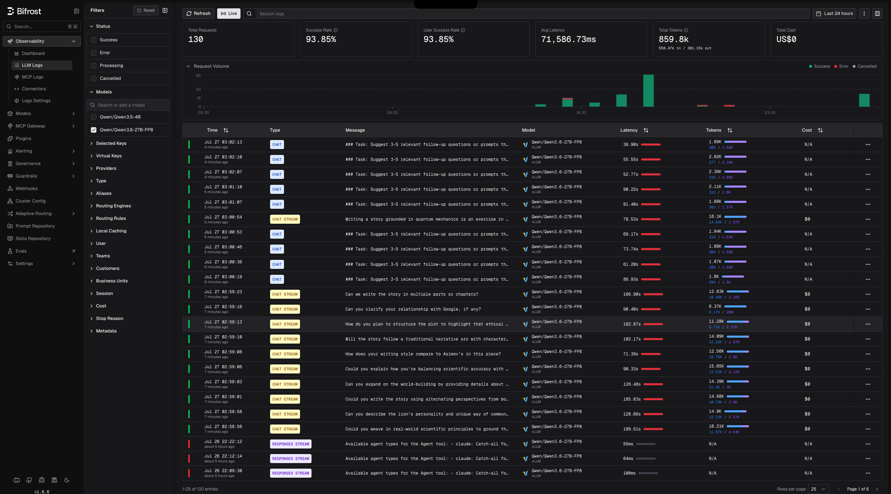

# Bifrost (OpenAI-compatible AI gateway)

[Bifrost](https://docs.getbifrost.ai/) is the **main production entry point**: the single
OpenAI-compatible front door for all inference. Users and agentic clients connect here. It
fans requests out to in-cluster vLLM/llm-d backends and to external hosted providers, and
it is where routing, cost modeling, and the overflow/off-hours fallback policy live. Every
client, including the internal Open WebUI test UI, points at Bifrost, not at model
services directly.

It handles routing for the vanilla vLLM deployments, following the Bifrost
[vLLM docs](https://docs.getbifrost.ai/providers/supported-providers/vllm#web-ui).
Exposed externally at `inference.gd03.me`.

## Files

| File | What it is |
|------|-----------|
| `deployment.yaml` | PVC (gp3, for config/state) + Deployment + Service |
| `httproute.yaml` | HTTPRoute exposing Bifrost on `inference.gd03.me` |
| `servicemonitor.yaml` | ServiceMonitor scraping Bifrost `/metrics` |

---

## Install

There are two ways in. The upstream docs use a Helm chart with an encryption key secret;
this repo pins the plain manifests. Pick one.

### Manifests (what's committed here)

```bash
kubectl create ns bifrost
kubectl apply -f deployment.yaml       # PVC + Deployment (maximhq/bifrost:latest) + Service
kubectl apply -f servicemonitor.yaml
kubectl apply -f httproute.yaml
```

Bifrost keeps its config on a 5Gi gp3 PVC mounted at `/app/data`, with `fsGroup: 1000` so
the container can write it.

### Helm (upstream, with encryption key)

```bash
kubectl create ns bifrost
kubectl create secret generic bifrost-encryption-key \
  --from-literal=encryption-key="$(openssl rand -base64 32)" -n bifrost

helm install bifrost bifrost/bifrost \
  --set image.tag=v1.4.11 \
  --set bifrost.encryptionKeySecret.name="bifrost-encryption-key" \
  --set bifrost.encryptionKeySecret.key="encryption-key" \
  -n bifrost
```

## Registering backends

In the Bifrost web UI (or its config), add each deployed model as a vLLM provider that
points at its in-cluster EPP service. For the Qwen3.6 deployment that is:

```
http://optimized-baseline-qwen36-epp.infra-qwen36.svc.cluster.local:80/v1
```

Clients then call Bifrost with the OpenAI API shape and Bifrost routes to the right
backend, or falls back to a hosted provider on overflow (or at night when the GPU nodes
are shut down).

Bifrost's own observability shows the live traffic flowing through it: per-request logs,
latency, token counts, and the gateway-level cost that powers the savings math. Here it is
serving real `Qwen/Qwen3.6-27B-FP8` traffic:



## Metrics

`servicemonitor.yaml` scrapes `/metrics` into Prometheus. It carries
`release: kube-prometheus-stack`, which is already set.
