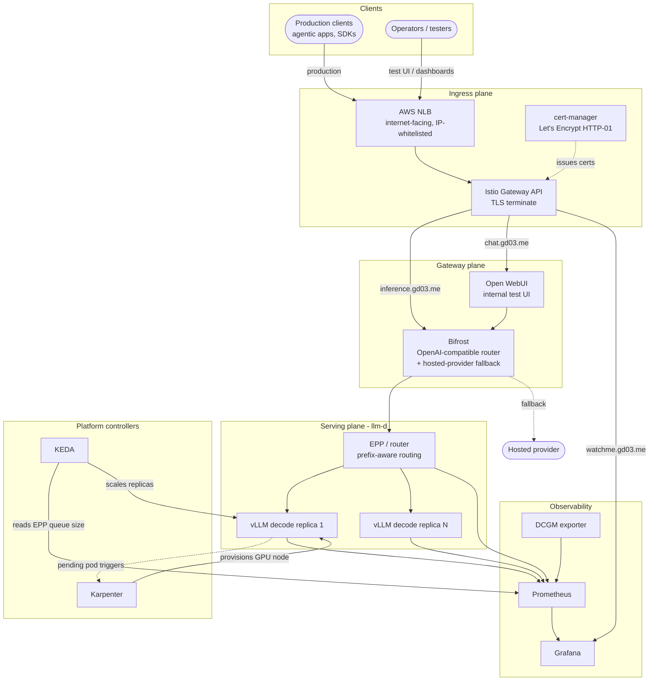
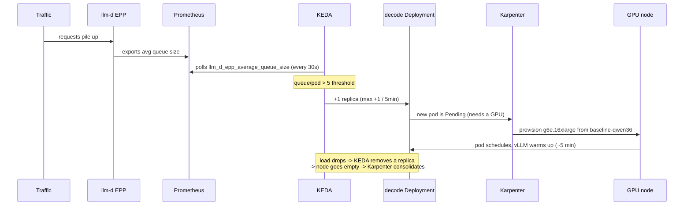
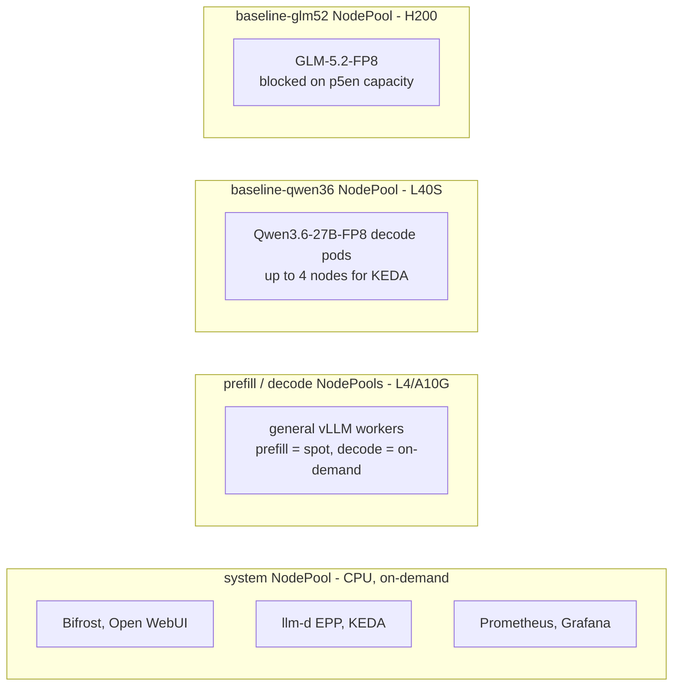

# Architecture

This is the deeper view of the inference infra: how a request flows, how the two
autoscalers cooperate, where the KV cache lives, and how the nodes are laid out. The
top-level README has the quick skeleton; this fills in the mechanics.

## The big picture

Three planes stack on top of each other:

1. **Ingress plane**: NLB to Istio Gateway, TLS terminated with cert-manager certs.
2. **Gateway plane**: Bifrost is the single OpenAI-compatible entry point for production
   traffic. Users and agentic clients talk to Bifrost, never to a model service directly.
   Open WebUI is a separate internal testing UI that hits cluster models directly, so it
   is not part of the production path.
3. **Serving plane**: llm-d routes to vLLM model servers running on GPU nodes.

Underneath all of it, Karpenter manages nodes and KEDA manages replicas.

## Request path

The production path (an OpenAI SDK or agentic client):

1. The client hits `inference.gd03.me`.
2. The NLB forwards to the Istio Gateway, which terminates TLS using the cert-manager
   certificate for that host.
3. The Gateway's HTTPRoute sends the request to **Bifrost**.
4. Bifrost picks a backend. For a self-hosted model it forwards to that model's llm-d
   **EPP** service. If the local pool is overflowing, or GPU nodes are down for the
   night, it falls back to a hosted provider instead.
5. The **EPP** does prefix-aware routing: it picks the vLLM replica most likely to
   already hold the relevant KV cache, so the prefill work is not repeated.
6. The chosen **vLLM** pod runs prefill then decode and streams tokens back out the same
   path.

Open WebUI (`chat.gd03.me`) is an internal testing UI for exercising cluster models by
hand. It is pointed at Bifrost too (`OPENAI_API_BASE_URL` is the Bifrost service), so it
shares the same backend routing as production clients. It is just a convenience UI for
testing, not the production front door that users and agentic clients connect through.

## The autoscaling loop

This is the part that makes it hands-off. The two controllers form a chain, driven by a
real serving signal rather than CPU:

Key numbers, from [`../infra-qwen36/keda-scaledobject-qwen36.yaml`](../infra-qwen36/keda-scaledobject-qwen36.yaml):

- Signal: `sum(llm_d_epp_average_queue_size{namespace="infra-qwen36"})`, threshold 5.
- Bounds: 1 to 4 replicas (the `baseline-qwen36` NodePool GPU limit is 4).
- Pace: at most +1 pod per 5 minutes (matches the ~5 minute vLLM cold start), -1 pod per
  10 minutes, with 10 minute stabilization windows.
- It can be made more reactive by shrinking the threshold and windows, since a new pod
  is ready inside ~5 minutes.

## Node topology

Karpenter owns all nodes. They split into CPU and GPU roles, separated by a label and a
matching taint so only the right pods land on the right nodes.

Design choices baked into the pools:

- **Prefill on spot, decode on on-demand.** A killed prefill worker just retries, so
  spot's 60 to 70% saving is worth it. A killed decode worker cuts off a user
  mid-generation, so decode stays on-demand.
- **Aggressive GPU consolidation.** GPU pools use `consolidateAfter: 1m` (the system
  pool uses 5m) because idle GPUs are the expensive thing.
- **Taints plus node selectors.** Every GPU node carries the `llm-d.ai/role` taint and a
  matching label. A vLLM pod without the right node selector would get scheduled onto the
  wrong GPU pool, so the selector is not optional.
- **`nvidia.com/gpu.present: "true"`** on GPU nodes is what the NVIDIA device plugin and
  DCGM exporter target.

## KV cache and inter-node transfer

llm-d integrates **LMCache** as a pluggable KV-cache manager. When cache has to move
between nodes (for example in a disaggregated prefill/decode setup, or to offload to
another filesystem), LMCache uses NVIDIA **NIXL** to choose the best route. On AWS that
route is **EFA**. This is why the H200 pick was `p5en.48xlarge` specifically: its v3 EFA
lowers inter-node latency by about 33% over the plain `p5e`.

For the current single-node Qwen3.6 deployment none of this crosses a node boundary yet,
but the pieces are in place to disaggregate prefill and decode later for more concurrency.

## Observability wiring

Three sources feed one Prometheus, visualized in Grafana:

- **Cluster**: kube-prometheus-stack.
- **GPU**: DCGM exporter on GPU nodes (utilization, memory, temp, power).
- **Serving**: vLLM pod metrics (via a PodMonitor from the kustomize `monitoring`
  component) and llm-d EPP/router metrics (enabled in the router Helm values).

Everything is selected by Prometheus through the `release: kube-prometheus-stack` label
on each ServiceMonitor/PodMonitor. Miss that label and the target is silently not
scraped. The custom EPP dashboard ([`../monitoring/llm-d-epp-dashboard.json`](../monitoring/llm-d-epp-dashboard.json))
visualizes the same `epp_pool_queue_size` signal that KEDA scales on, so you can watch
the autoscaling decision and its input side by side.

## Where to go next

- Build order and commands: [top-level README](../README.md).
- The model deployment and tuning story: [`../infra-qwen36/README.md`](../infra-qwen36/README.md).
- Node autoscaling internals: [`../karpenter/README.md`](../karpenter/README.md).
