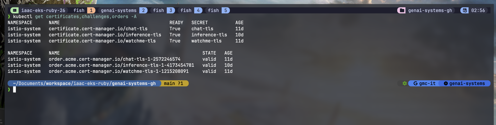

# Gateway (Istio + Gateway API + cert-manager)

All external traffic comes in through an Istio-managed Gateway API `Gateway` behind an
AWS NLB. TLS is terminated at the gateway using Let's Encrypt certs that cert-manager
issues over the HTTP-01 challenge. Backends attach with `HTTPRoute` resources that point
at a named listener via `sectionName`.

## Files

| File | What it is |
|------|-----------|
| `letsencrypt-http01.yaml` | `ClusterIssuer`, a cluster-wide Let's Encrypt CA over HTTP-01 |
| `cluster-gateway.yaml` | The `Gateway`, with NLB annotations and one listener per host |

---

## 1. Gateway API CRDs (Istio needs these)

```bash
kubectl apply -f https://github.com/kubernetes-sigs/gateway-api/releases/download/v1.3.0/standard-install.yaml
```

## 2. cert-manager

Handles TLS and cert issuance/renewal for Istio.

```bash
helm repo add jetstack https://charts.jetstack.io
helm upgrade --install cert-manager jetstack/cert-manager \
  --namespace cert-manager --create-namespace \
  --set crds.enabled=true --wait
```

Once it is up you set up a ClusterIssuer or Issuer (below) before any certs get signed.

## 3. Istio (base and istiod, no ingress workload yet)

Istio base is the CRDs, istiod is the control plane. There is no separate ingress gateway
workload here: the `Gateway` resource itself makes Istio stand up the data-plane proxy.

```bash
kubectl create namespace istio-system
helm repo add istio https://istio-release.storage.googleapis.com/charts
helm upgrade --install istio-base istio/base -n istio-system --set defaultRevision=default --wait
helm upgrade --install istiod istio/istiod -n istio-system --wait
```

## 4. Teach cert-manager the Gateway API

By default cert-manager knows about Ingress, not Gateway API. Flip it on:

```bash
helm upgrade cert-manager jetstack/cert-manager \
  --namespace cert-manager --reuse-values \
  --set config.apiVersion=controller.config.cert-manager.io/v1alpha1 \
  --set config.kind=ControllerConfiguration \
  --set config.enableGatewayAPI=true \
  --wait
```

## 5. ClusterIssuer

A cluster-wide certificate authority that can sign certs in any namespace. It solves the
ACME HTTP-01 challenge by having cert-manager attach a temporary HTTPRoute to our gateway.

```bash
kubectl apply -f letsencrypt-http01.yaml -n istio-system
```

On HTTP-01 vs DNS-01: this repo uses **HTTP-01**, where cert-manager auto-creates a
temporary HTTPRoute and solver pods on the subdomain and the challenge self-resolves. You
could instead do **DNS-01** by importing a TLD cert from ACM, which is simpler if you
already have one.

## 6. The Gateway

```bash
kubectl apply -f cluster-gateway.yaml
```

What matters in `cluster-gateway.yaml`:

- `gatewayClassName: istio` is the GatewayClass Istio registered on install, so we pick
  that.
- NLB via `infrastructure.annotations`: `external`, `nlb-target-type: ip`,
  `scheme: internet-facing`.
- **IP whitelisting** via `aws-load-balancer-security-group-prefix-lists:
  pl-0bbaf5fc07815e736` (a VPN prefix list), so only whitelisted IPs reach the
  internet-facing LB.
- The `cert-manager.io/cluster-issuer: letsencrypt-http01` annotation drives automatic
  cert issuance for the HTTPS listeners.

Listeners:

| Listener | Host | TLS secret |
|----------|------|-----------|
| `http` (80) | all | none (ACME challenge / redirect) |
| `https-grafana` (443) | `watchme.gd03.me` | `watchme-tls` |
| `https-openwebui` (443) | `chat.gd03.me` | `chat-tls` |
| `https-bifrost` (443) | `inference.gd03.me` | `inference-tls` |

Once this gateway is applied, cert-manager sets up the temporary HTTPRoute and challenge
pods on each domain, which auto-resolve.

## 7. Wait for the certificates

Issuance can take a few attempts. When it succeeds the temporary solver route and pods go
away, and then you can add real backend routes.

```bash
kubectl get certificates,challenges,orders -A
# if a cert is stuck, delete it to restart the ACME flow:
# kubectl delete certificate <name> -n istio-system
```

Once it settles, all three certs read `Ready`, their ACME orders `valid`, and the
challenges are gone:



## 8. Attach backends

Each service brings its own `HTTPRoute` that references a listener with `sectionName`.
See [`../monitoring/httproute-grafana.yaml`](../monitoring/httproute-grafana.yaml),
[`../chat/openwebui.yaml`](../chat/openwebui.yaml), and
[`../bifrost/httproute.yaml`](../bifrost/httproute.yaml).
