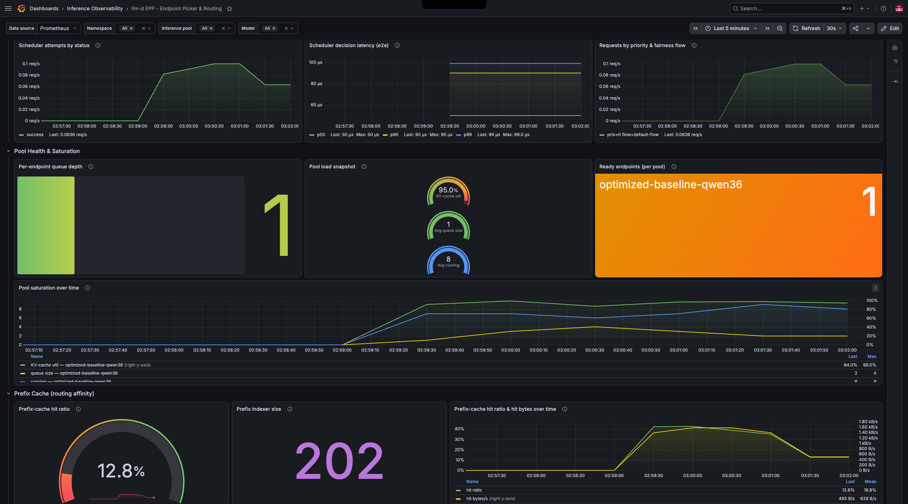

# infra-qwen36 (Qwen3.6-27B-FP8 on L40S via llm-d)

This is the working reference deployment: **Qwen3.6-27B-FP8** served by **vLLM** under
**llm-d**, on a single `g6e.16xlarge` (NVIDIA **L40S**, about 44 GB usable HBM), tuned for
performance and scaled horizontally by **KEDA**.

It exists because the original target, GLM-5.2-FP8 on 8x H200
([`../karpenter/nodepools-glm52.yaml`](../karpenter/nodepools-glm52.yaml)), was blocked on
`p5en.48xlarge` capacity in `ap-south-1`. Rather than wait, I ran the same pattern on
hardware I could actually get. The story of that pivot is in the top-level README.

## How llm-d is laid out

llm-d infra is set up once and is kept distinct from model deployments, which each carry
their own stack. A stack has:

- a **model server**, deployed via **kustomize**
- a **router (EPP, the Endpoint Picker)**, deployed via **Helm**
- a **gateway**, which we do not use here, because every model is fronted by Bifrost
  instead

Each component has a base plus scenario-specific overrides via kustomize, from the
upstream repo under `guides/`. We use the `optimized-baseline` guide (llm-d v0.8.1, router
chart v0.9.0).

## Files

| File | What it is |
|------|-----------|
| `nodepools-qwen36.yaml` | Karpenter `baseline-qwen36` NodePool (`g6e.16xlarge`, up to 4 nodes) |
| `llm-d-kustomize/kustomization.yaml` | Kustomize overlay wiring base + image + monitoring components |
| `llm-d-kustomize/patch-vllm.yaml` | The vLLM `decode` deployment patch (args, resources, scheduling) |
| `keda-scaledobject-qwen36.yaml` | KEDA ScaledObject scaling decode replicas on EPP queue size |

The `llm-d-kustomize/` files are meant to be copied into the (gitignored) upstream clone
at `src/llm-d/guides/optimized-baseline/modelserver/gpu/vllm/qwen-3.6/`. The `../` paths
inside `kustomization.yaml` are relative to that location.

---

## 1. GAIE (Gateway API Inference Extension) CRDs

Install once per cluster. The version tracks your Gateway API version.

```bash
kubectl apply -f https://github.com/kubernetes-sigs/gateway-api-inference-extension/releases/download/1.5.0/v1-manifests.yaml
```

## 2. NodePool

`baseline-qwen36` pins `g6e.16xlarge` (L40S), on-demand, tainted
`llm-d.ai/role=baseline-qwen36`, and labeled for the NVIDIA device plugin and DCGM. The
GPU limit is 4, so KEDA can scale to 4 single-GPU replicas, one node each.

A note on this: the nodepool is limited by single-node resources, so Karpenter can only
spin up one node even when KEDA asks for more, unless the limit allows it. That is why the
limit was raised to fit up to 4 nodes:

```yaml
limits: {cpu: 256, memory: 2048Gi, nvidia.com/gpu: 4}
```

```bash
kubectl apply -f nodepools-qwen36.yaml
```

It uses the `gpu-l40s` EC2NodeClass from
[`../karpenter/ec2-nodeclasses.yaml`](../karpenter/ec2-nodeclasses.yaml)
(`instanceStorePolicy: RAID0`, so model weights live on the instance's 1.9 TB NVMe).

## 3. Namespace and HuggingFace token

```bash
export NAMESPACE=infra-qwen36
kubectl create ns $NAMESPACE
kubectl create secret generic llm-d-hf-token \
  --from-literal=HF_TOKEN="hf_xxxx" -n $NAMESPACE
```

## 4. Router (Helm)

Installed in standalone mode from the llm-d router chart (v0.9.0).

```bash
export GUIDE_NAME=optimized-baseline
export ROUTER_STANDALONE_CHART=oci://ghcr.io/llm-d/charts/llm-d-router-standalone
export ROUTER_CHART_VERSION=v0.9.0
export REPO_ROOT=<path-to-your-llm-d-clone>

helm install $GUIDE_NAME-qwen36 \
  $ROUTER_STANDALONE_CHART \
  -f $REPO_ROOT/guides/recipes/router/base.values.yaml \
  -f $REPO_ROOT/guides/$GUIDE_NAME/router/$GUIDE_NAME.values.yaml \
  -n $NAMESPACE --version $ROUTER_CHART_VERSION
```

To turn on EPP/router metrics, add this to `guides/recipes/router/base.values.yaml`
before installing (or `helm upgrade` afterwards):

```yaml
monitoring:
  interval: "10s"
  prometheus:
    enabled: true
    auth:
      enabled: false
```

## 5. Model server (kustomize)

Copy `llm-d-kustomize/` into the guide tree, then apply:

```bash
kubectl apply -n $NAMESPACE -k $REPO_ROOT/guides/optimized-baseline/modelserver/gpu/vllm/qwen-3.6/
```

The overlay:

- `kustomization.yaml`: base `single-host/default` plus `components/images/gpu-vllm` plus
  `components/monitoring`, the name prefix `optimized-baseline-nvidia-gpu-vllm-qwen36-`,
  and the model labels.
- `patch-vllm.yaml`: patches the `decode` Deployment with the `baseline-qwen36` node
  selector and toleration, the `vllm serve` args, resources (`nvidia.com/gpu: 1`), the HF
  token env, cache volumes, and probes.

The model is then live at its EPP service:

```
http://optimized-baseline-qwen36-epp.infra-qwen36.svc.cluster.local:80/v1
```

Register that URL in Bifrost ([`../bifrost/`](../bifrost/)).

---

## 6. Tuning: MTP and max-num-seqs (why the args are what they are)

### The OOM

Applied raw, the pod OOM-crashed:

```
(EngineCore) torch.OutOfMemoryError: CUDA out of memory. Tried to allocate 1.53 GiB.
GPU 0 has a total capacity of 44.39 GiB of which 1.25 GiB is free ...
```

A 27B model should not fill 44 GB, but vLLM pre-allocates KV-cache headroom sized by
`--max-num-seqs` (default 256). The fix is to set `--max-model-len` and `--max-num-seqs`
explicitly. And when MTP (speculative decoding) is on, memory takes another hit, so
`--max-num-seqs` has to come down further.

### Benchmark results (at 128k context window, which is non-negotiable for agentic tasks)

| Config | max-num-seqs | Result |
|--------|--------------|--------|
| No MTP | up to 160 | 18.9 tok/s |
| MTP=2 | 16 (breaks at 160) | 23.4 tok/s |
| MTP=3 | 16 | 43.8 tok/s (+135%) |
| MTP=3 | 32 | **48.6 tok/s** (works) |
| MTP=3 | 40 / 50 | OOM crash |

So 32 is the ceiling for this stack. The takeaway: set a comfortable MTP first, then walk
`max-num-seqs` up until it crashes and back off one step.

### Final stack config

```
GPU:           L40S (~44 GiB usable HBM) on g6e.16xlarge
MTP:           3   (--speculative-config qwen3_next_mtp, num_speculative_tokens=3)
Context:       128k (--max-model-len=128192)
max-num-seqs:  32  (concurrent token processing, the OOM ceiling here)
```

Throughput vs performance: because the model fits one full node given instance
availability, the stack is tuned for per-request performance, and throughput scales
horizontally with KEDA. See `patch-vllm.yaml` for the full arg list, including the flags
left commented out and why (`--kv-cache-dtype`, `--language-model-only`,
`--enforce-eager`).

---

## 7. Observability

The vLLM pods already have PodMonitors applied from kustomize, via the
`components/monitoring` line in `kustomization.yaml`. The one catch is that the PodMonitor
needs the `release: kube-prometheus-stack` label for this Prometheus to pick it up. Add
that label to `guides/recipes/modelserver/components/monitoring/decode-podmonitor.yaml`,
then re-apply the overlay:

```bash
kubectl apply -n $NAMESPACE -k $REPO_ROOT/guides/optimized-baseline/modelserver/gpu/vllm/qwen-3.6/
```

For router/EPP monitoring, enable it in the router Helm values (step 4) and then
`helm upgrade $GUIDE_NAME-qwen36 ...`. The custom EPP dashboard is at
[`../monitoring/llm-d-epp-dashboard.json`](../monitoring/llm-d-epp-dashboard.json). It
shows the `optimized-baseline-qwen36` pool: per-endpoint queue depth, KV-cache
saturation, and the prefix-cache hit ratio, which is the exact signal KEDA scales on
below:



---

## 8. KEDA autoscaling

KEDA scales `decode` replicas on the EPP average queue size, a real serving signal rather
than CPU. Each replica needs its own GPU node, and the `baseline-qwen36` NodePool GPU
limit is 4, hence `maxReplicaCount: 4`.

```bash
helm repo add kedacore https://kedacore.github.io/charts
helm install keda kedacore/keda --namespace keda --create-namespace --wait

kubectl apply -f keda-scaledobject-qwen36.yaml
```

In brief (`keda-scaledobject-qwen36.yaml`):

- Target: the `...-qwen36-decode` Deployment, `minReplicaCount: 1`, `maxReplicaCount: 4`.
- Trigger: Prometheus `sum(llm_d_epp_average_queue_size{namespace="infra-qwen36"})`,
  threshold 5, so a pod is added when the average queue per pod goes above 5.
- Behavior: +1 pod per 5 minutes (matches the roughly 5 minute cold start), -1 pod per 10
  minutes, with 10 minute stabilization windows.

This can be made more reactive by reducing the threshold and windows, since a new pod in
this stack is ready inside about 5 minutes. It is fine as-is for now.

With this in place the model has a full llm-d stack: serving, complete observability, and
event-driven autoscaling.
