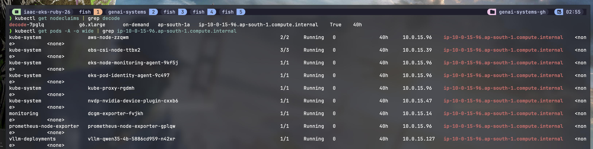

# Karpenter (node autoscaling)

Karpenter provisions and consolidates nodes just in time from **NodePools**. Think of it
like the cluster autoscaler but faster and instance-flexible: a pending pod that matches
a NodePool's requirements makes Karpenter launch a fitting EC2 node, and when nodes go
empty or underutilized it consolidates them away to save money.

Here it runs CPU nodes for system components and GPU nodes (L4/A10G, L40S, H200) for
model serving, split by role with labels and taints.

## Files

| File | What it is |
|------|-----------|
| `ec2-nodeclasses.yaml` | `EC2NodeClass` resources (AMI, IAM role, subnet/SG discovery, disks) for `system`, `gpu`, `gpu-l40s`, `gpu-h200` |
| `nodepools.yaml` | The general `system` (CPU), `prefill` (GPU/spot), `decode` (GPU/on-demand) NodePools |
| `nodepools-glm52.yaml` | `baseline-glm52` NodePool for `p5en.48xlarge` (8x H200), for GLM-5.2 |
| `gpu-smoke-test.yaml` | A CUDA pod that runs `nvidia-smi` to prove GPU scheduling works |
| `service-monitor.yaml` | ServiceMonitor scraping Karpenter's own `/metrics` |

The Qwen3.6 NodePool lives next to its model in
[`../infra-qwen36/nodepools-qwen36.yaml`](../infra-qwen36/nodepools-qwen36.yaml).

---

## 1. IAM role for the Karpenter controller (Pod Identity)

Trust policy (`karpenter-controller-trust-policy.json`):

```json
{
  "Version": "2012-10-17",
  "Statement": [{
    "Effect": "Allow",
    "Principal": {"Service": "pods.eks.amazonaws.com"},
    "Action": ["sts:AssumeRole", "sts:TagSession"]
  }]
}
```

```bash
aws iam create-role \
  --role-name KarpenterControllerRole-${CLUSTER_NAME} \
  --assume-role-policy-document file://karpenter-controller-trust-policy.json
```

Then bind that role to the `karpenter` ServiceAccount using the Pod Identity Agent addon:

```bash
aws eks create-pod-identity-association \
  --cluster-name $CLUSTER_NAME \
  --namespace kube-system \
  --service-account karpenter \
  --role-arn arn:aws:iam::$AWS_ACCOUNT_ID:role/KarpenterControllerRole-$CLUSTER_NAME
```

## 2. CloudFormation stack (node role, interruption queue, EventBridge)

This creates what Karpenter needs at runtime: the **node IAM role and policies**, an
**SQS InterruptionQueue**, and **EventBridge rules** that watch EC2 node status and spot
interruptions.

```bash
curl -fsSL https://raw.githubusercontent.com/aws/karpenter-provider-aws/v${KARPENTER_VERSION}/website/content/en/preview/getting-started/getting-started-with-karpenter/cloudformation.yaml -o karpenter-cf.yaml

aws cloudformation deploy \
  --stack-name "Karpenter-$CLUSTER_NAME" \
  --template-file karpenter-cf.yaml \
  --capabilities CAPABILITY_NAMED_IAM \
  --parameter-overrides "ClusterName=$CLUSTER_NAME"
```

## 3. Install Karpenter (Helm)

Karpenter needs some baseline compute to run on, and it must not run on the nodes it
manages. So it starts on a small 2-node managed nodegroup (some compute has to exist
before Karpenter can create the rest). Affinities and taints to fully isolate it can be
layered in later.

```bash
helm upgrade --install karpenter oci://public.ecr.aws/karpenter/karpenter \
  --version "$KARPENTER_VERSION" \
  --namespace kube-system \
  --set settings.clusterName=$CLUSTER_NAME \
  --set settings.interruptionQueue=$CLUSTER_NAME \
  --set controller.resources.requests.cpu=1 \
  --set controller.resources.requests.memory=1Gi \
  --wait
```

## 4. Discovery tags

Karpenter finds subnets and security groups by the `karpenter.sh/discovery` tag. Tag one
subnet per AZ so it has AZ choice, and at least one security group so the
nodeclass/nodepool can work. Here the auto-generated SG of the base nodegroup was tagged,
for a simpler setup and to avoid errors down the line.

```bash
aws ec2 create-tags --resources subnet-0c863ec6104e5ff8b \
  --tags Key=karpenter.sh/discovery,Value=$CLUSTER_NAME
aws ec2 create-tags --resources subnet-03f2e09f09dd63eb8 \
  --tags Key=karpenter.sh/discovery,Value=$CLUSTER_NAME
aws ec2 create-tags --resources subnet-0a25daa00e5554991 \
  --tags Key=karpenter.sh/discovery,Value=$CLUSTER_NAME
# do the same for at least one security group
```

## 5. EC2NodeClasses and NodePools

```bash
kubectl apply -f ec2-nodeclasses.yaml
kubectl apply -f nodepools.yaml
kubectl apply -f nodepools-glm52.yaml     # H200 pool, apply when p5en capacity exists
```

**NodeClasses** (`ec2-nodeclasses.yaml`):

| Name | AMI | Notes |
|------|-----|-------|
| `system` | AL2023 latest | CPU nodes |
| `gpu` | `amazon-eks-node-al2023-x86_64-nvidia-*` | Shared by `prefill` and `decode`, 100Gi gp3 root |
| `gpu-l40s` | NVIDIA AL2023 | `instanceStorePolicy: RAID0`, uses the instance's 1.9 TB NVMe for weights |
| `gpu-h200` | NVIDIA AL2023 | `instanceStorePolicy: RAID0`, uses the instance's 3 TB NVMe |

**NodePools** (`nodepools.yaml`):

| Pool | Capacity | Instances | Taint / label | Why |
|------|----------|-----------|---------------|-----|
| `system` | on-demand | `c`, `m` categories | none | Gateway, EPP, KEDA, llm-d controller |
| `prefill` | **spot** + on-demand | `g5/g6 .xlarge/.2xlarge` | `llm-d.ai/role=prefill` | A killed prefill worker just retries, and it can tolerate the ~2 min spot callback, so spot saves 60 to 70% |
| `decode` | **on-demand only** | `g5/g6 .xlarge/.2xlarge` | `llm-d.ai/role=decode` | A mid-generation kill is user-visible, so no spot |

- GPU pools set `consolidateAfter: 1m` to save GPU cost quickly. The `system` pool uses
  `5m`.
- Every GPU node carries `nvidia.com/gpu.present: "true"` (so the device plugin and DCGM
  exporter target it) and the `llm-d.ai/role` taint (so only tolerating LLM pods land
  there).

## 6. NVIDIA device plugin

The AMI ships GPU drivers, but `nvidia.com/gpu` will not show up as a schedulable
resource until this DaemonSet runs. The tolerations let it schedule onto the tainted GPU
nodes.

```bash
helm repo add nvdp https://nvidia.github.io/k8s-device-plugin
helm upgrade --install nvdp nvdp/nvidia-device-plugin \
  --namespace kube-system \
  --set tolerations[0].key=llm-d.ai/role \
  --set tolerations[0].operator=Exists \
  --set tolerations[0].effect=NoSchedule
```

## 7. GPU smoke test

This validates the whole chain: apply a CUDA pod pinned to the `decode` pool, Karpenter
spins up a GPU node, the scheduler places the pod, and `nvidia-smi` returns GPU data from
inside the container.

```bash
kubectl apply -f gpu-smoke-test.yaml
kubectl logs gpu-smoke-test        # expect an nvidia-smi table, e.g. NVIDIA L4, 23 GB
kubectl delete -f gpu-smoke-test.yaml
```

Deleting the pod takes the node out too, since the GPU pools consolidate 1 minute after
going empty.

Here Karpenter has provisioned a `g6.xlarge` decode node on demand, and the pod (plus the
device plugin and DCGM daemons) has landed on it:



## 8. Karpenter metrics (optional)

```bash
kubectl apply -f service-monitor.yaml   # scrapes karpenter /metrics into Prometheus
```

It carries the `release: kube-prometheus-stack` label so this Prometheus instance selects
it.
